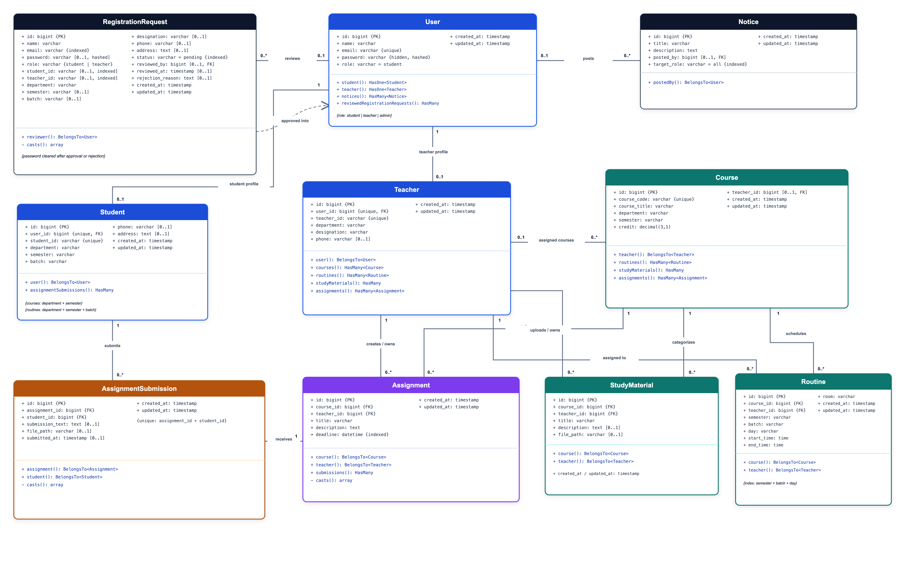

# UniTrack

<div align="center">
  <strong>Student Academic Resource Management System</strong>
  <br><br>
  Laravel 13 | Blade | Tailwind CSS 4 | MySQL | Jira Scrum | GitHub Flow
</div>

<br>


UniTrack is a role-based academic resource platform for students, teachers, and administrators. It brings courses, class routines, notices, study materials, assignments, submissions, profiles, and account approval into one Laravel application.

This repository records more than the final software. It shows how a three-member team planned, implemented, reviewed, tested, and documented the system through a traceable Agile Scrum workflow. Jira work items were connected to feature branches, commits, pull requests, reviews, automated checks, and sprint evidence throughout development.

## Project at a Glance

| Area | Detail |
|---|---|
| Product | UniTrack: Student Academic Resource Management System |
| Release scope | Minimum V1 |
| Users | Student, Teacher, Admin, and account applicant |
| Architecture | Laravel MVC with role middleware and server-rendered Blade views |
| Delivery model | Agile Scrum across three planned sprints |
| Project management | Jira epics, stories, subtasks, sprints, estimates, assignees, and status tracking |
| Source control | Jira-keyed feature branches, reviewed pull requests, `dev` integration, and `main` releases |
| Verified baseline | 78 tests, 556 assertions, production asset build, formatting checks, and dependency audits |

## Product Scope

| Role | Implemented capabilities |
|---|---|
| Student | Sign in, update own profile, view matched courses and routine, read targeted notices, download materials, view assignments, and submit or replace assignment work |
| Teacher | Sign in, update own profile, view assigned courses and routine, manage own notices, materials, and assignments, and review or download student submissions |
| Admin | Sign in, review registration requests, manage students, teachers, courses, routines, notices, materials, and assignments, and inspect submissions |
| Applicant | Submit a Student or Teacher account request and wait for Admin approval before first login |

Authentication uses the stored `users.role` value to redirect each approved user to the correct workspace. Laravel authentication and role middleware protect every role route, and unsupported or cross-role access is rejected.

## Application Gallery

<table>
  <tr>
    <td width="50%"></td>
    <td width="50%"></td>
  </tr>
  <tr>
    <td align="center"><strong>Student workspace</strong><br>Courses, routine, notices, materials, assignments, and profile</td>
    <td align="center"><strong>Teacher workspace</strong><br>Assigned teaching data and academic content management</td>
  </tr>
</table>

<table>
  <tr>
    <td width="50%"></td>
    <td width="50%"></td>
  </tr>
  <tr>
    <td align="center"><strong>Admin control center</strong><br>Live database summaries and management entry points</td>
    <td align="center"><strong>Account approval</strong><br>Student and Teacher request review with approve or reject actions</td>
  </tr>
</table>

The complete presentation set contains 26 application screens, including profile, course, routine, notice, material, assignment, submission, management, and responsive login views. See the [SCRUM-46 presentation evidence index](docs/presentation-evidence/SCRUM-46/README.md).

## Architecture and Data Design

UniTrack follows Laravel MVC conventions:

1. Routes receive public, authenticated, and role-scoped requests.
2. Controllers validate input, authorize ownership, coordinate storage, and prepare responses.
3. Eloquent models represent the MySQL schema and its relationships.
4. Blade views render live database data through reusable layouts and components.
5. Vite builds the Tailwind CSS, local fonts, and local icon assets used by the interface.

Core records include users, student and teacher profiles, courses, routines, notices, study materials, assignments, assignment submissions, and registration requests. Private material and submission files are served only through authorized controller actions.

### UML Class Model

[](docs/diagrams/uml-class-diagram.svg)

### Diagram Set

| Diagram | PNG | SVG |
|---|---|---|
| UML class diagram | [View](docs/diagrams/uml-class-diagram.png) | [Source](docs/diagrams/uml-class-diagram.svg) |
| UML use-case diagram | [View](docs/diagrams/use-case-diagram.png) | [Source](docs/diagrams/use-case-diagram.svg) |
| Data-flow context diagram | [View](docs/diagrams/data-flow-diagram-context.png) | [Source](docs/diagrams/data-flow-diagram-context.svg) |
| Core data-flow diagram | [View](docs/diagrams/data-flow-diagram.png) | [Source](docs/diagrams/data-flow-diagram.svg) |
| Academic-content data flow | [View](docs/diagrams/data-flow-diagram-academic.png) | [Source](docs/diagrams/data-flow-diagram-academic.svg) |

## Software Development Life Cycle

The project used a practical Scrum-based SDLC. Requirements, implementation, and evidence were kept connected instead of being prepared only at the end.

### 1. Requirements and Design

The team established the project scope before feature implementation:

- Product scope and success criteria in [PROJECT_OVERVIEW.md](docs/PROJECT_OVERVIEW.md)
- Role behavior and acceptance criteria in [System_and_Functional_Requirements.md](docs/System_and_Functional_Requirements.md)
- MVC, database, route, security, and deployment decisions in [Design_and_Technical_Requirements.md](docs/Design_and_Technical_Requirements.md)
- Interface rules and design tokens in [UI_and_UX_Design_Specification.md](docs/UI_and_UX_Design_Specification.md)
- Team coding standards in [CODING_RULES.md](docs/CODING_RULES.md)

These documents formed the reference for Jira work breakdown, code review, integration testing, and final verification.

### 2. Scrum Planning in Jira

Work was organized into epics, stories, tasks, and subtasks. Each active item carried an assignee, sprint, estimate, dates, and a status that followed:

```text
To Do -> In Progress -> In Review -> Done
```

The planned sprint progression was:

| Sprint | Goal | Main outcome |
|---|---|---|
| Sprint 1 | Project setup and planning | Jira and GitHub workflow, requirements, UI specification, Laravel foundation, and database schema |
| Sprint 2 | Core module development | Authentication, role access, profiles, dashboards, courses, and routines |
| Sprint 3 | Academic content and finalization | Notices, materials, assignments, submissions, integration, audit, testing, and presentation evidence |

### 3. Jira to GitHub Traceability

Every coding task was expected to carry the same Jira key through the development chain:

```text
Jira work item:  SCRUM-28
Feature branch:  feature/SCRUM-28-test-review-minimum-v1-core-flow
Commit:          SCRUM-28 Harden V1 production flows
Pull request:    SCRUM-28: Test and review Minimum V1 core flow
Merge target:    dev
```

Feature work was not pushed directly to `main` or `dev`. Team members created branches from the latest `dev`, opened focused pull requests back into `dev`, addressed review or integration issues, and merged only after verification. Tested sprint output moved from `dev` to `main` through a release pull request.

<table>
  <tr>
    <td width="50%"></td>
    <td width="50%"></td>
  </tr>
  <tr>
    <td align="center"><strong>Jira planning evidence</strong><br>Sprint timeline, epics, ownership, and delivery dates</td>
    <td align="center"><strong>GitHub delivery evidence</strong><br>Feature pull requests reviewed and integrated into <code>dev</code></td>
  </tr>
</table>

Jira was also connected to GitHub development activity, allowing linked pull requests and repository work to be reviewed from the project workspace.


### 4. Review, Integration, and Quality Gates

The Definition of Done required completed implementation, successful tests, a reviewed pull request where applicable, no unresolved major defect, and an accurate Jira status.

The repository quality gate checks:

- Laravel feature and integration tests
- PHP formatting with Laravel Pint
- Blade template compilation
- Vite production build
- Composer metadata and lock-file validity
- Composer and npm security advisories
- Role protection, validation, search, filters, uploads, private downloads, and cleanup behavior
- Desktop and mobile overflow checks on presentation-critical pages

The final recorded V1 verification passed 78 Laravel tests with 556 assertions. The Vite build, Pint check, Blade view cache, Composer validation, Composer audit, and npm audit also passed.

### 5. Release Evidence

The final evidence package combines the running application, MySQL schema, Jira planning, GitHub pull requests and commits, documentation, and verification results.

<table>
  <tr>
    <td width="50%"></td>
    <td width="50%"></td>
  </tr>
  <tr>
    <td align="center"><strong>Database evidence</strong><br>Applied schema and seeded Minimum V1 records</td>
    <td align="center"><strong>Commit evidence</strong><br>Incremental Jira-linked delivery on the development branch</td>
  </tr>
</table>

## Scrum Master Contribution

Khalid served as Scrum Master and Full Stack Developer. The role combined delivery coordination with hands-on integration work.

Scrum responsibilities included:

- Creating and maintaining the Jira project, backlog, sprint structure, work hierarchy, and status flow
- Defining sprint goals, task ownership, estimates, dates, and the project Definition of Done
- Tracking progress, reviewing blockers, and coordinating frontend and backend work
- Establishing the Git branch, commit, pull request, review, and release rules
- Reviewing teammate pull requests and resolving cross-branch integration conflicts
- Keeping Jira, GitHub, database, documentation, and application evidence aligned for sprint reviews

Engineering responsibilities included:

- Integrating authentication, role middleware, protected routes, and role-based redirection
- Connecting Blade screens to controllers, Eloquent models, validation, storage, and MySQL data
- Completing registration approval, profile, content-management, submission, and dashboard flows
- Auditing ownership boundaries, private file access, error handling, responsive behavior, and release readiness
- Running final verification and preparing the presentation evidence package

This dual role kept planning decisions close to implementation while preserving clear task ownership for the Frontend and Backend developers.

## Team

| Roll | Member | Project role | Primary contribution |
|---|---|---|---|
| 2207035 | Khalid | Scrum Master and Full Stack Developer | Planning, workflow governance, integration, review, testing, and release evidence |
| 2207036 | Sadik | Frontend Developer | Blade pages, role dashboards, responsive layouts, and interface components |
| 2207031 | Siyam | Backend Developer | Models, controllers, database flows, middleware, CRUD operations, and search logic |

## Technology Stack

| Layer | Technology |
|---|---|
| Backend | PHP 8.4+, Laravel 13, Eloquent ORM |
| Frontend | Laravel Blade, Tailwind CSS 4, Vite 8 |
| Database | MySQL |
| Testing and quality | PHPUnit, Laravel Pint, Composer Audit, npm Audit |
| Project management | Jira Scrum |
| Version control and review | Git, GitHub, GitHub Actions |
| Local environments | MAMP, XAMPP, Laragon, or a direct MySQL installation |

## Local Development

### Requirements

- PHP `^8.4.1`
- Composer
- Node.js `>=22.12.0`
- npm `>=10`
- MySQL 8 or a compatible local MySQL server

### 1. Clone the Development Branch

```bash
git clone -b dev --single-branch https://github.com/khalid999devs/unitrack-isd-lab.git
cd unitrack-isd-lab
```

### 2. Install Dependencies

```bash
composer install
npm install
```

### 3. Configure the Application

```bash
cp .env.example .env
php artisan key:generate
```

Create a MySQL database named `unitrack_db`, then set the database values in `.env`.

Common XAMPP or direct MySQL values:

```env
DB_CONNECTION=mysql
DB_HOST=127.0.0.1
DB_PORT=3306
DB_DATABASE=unitrack_db
DB_USERNAME=root
DB_PASSWORD=
DB_SOCKET=
```

Typical MAMP values on macOS:

```env
DB_CONNECTION=mysql
DB_HOST=127.0.0.1
DB_PORT=8889
DB_DATABASE=unitrack_db
DB_USERNAME=root
DB_PASSWORD=root
DB_SOCKET=/Applications/MAMP/tmp/mysql/mysql.sock
```

### 4. Build the Database

```bash
php artisan migrate:fresh --seed
```

This command creates the complete schema and loads the Minimum V1 demonstration data.

### 5. Run UniTrack

Start Laravel:

```bash
php artisan serve
```

Start Vite in a second terminal:

```bash
npm run dev
```

Open [http://127.0.0.1:8000/login](http://127.0.0.1:8000/login).

## Demo Accounts

Demo accounts are created only by the local database seeder.

| Role | Email | Password |
|---|---|---|
| Admin | `admin@unitrack.test` | `password` |
| Student | `student@unitrack.test` | `password` |
| Student | `student2@unitrack.test` | `password` |
| Teacher | `teacher@unitrack.test` | `password` |
| Teacher | `teacher2@unitrack.test` | `password` |

To demonstrate the approval flow, submit a Student or Teacher request at `/register`, sign in as Admin, review the request under Registrations, approve it, and then sign in with the approved account.

## Verification

Run the project checks before opening a pull request:

```bash
./vendor/bin/pint --test
php artisan test
php artisan view:cache
npm run build
composer validate --strict
composer audit --locked --no-interaction
npm audit
```

Use `./vendor/bin/pint` to apply PHP formatting fixes when required.

## Contribution Workflow

All feature work starts from the latest `dev` branch:

```bash
git switch dev
git pull origin dev
git switch -c feature/SCRUM-ID-short-task-name
```

Rules:

1. Do not push feature work directly to `main` or `dev`.
2. Keep one focused feature branch per Jira task.
3. Use `feature/SCRUM-ID-short-task-name` for branch names.
4. Use `SCRUM-ID Short action` for commit messages.
5. Push the feature branch and open a pull request into `dev`.
6. Use `SCRUM-ID: Short task title` for pull request titles.
7. Include completed work, verification, and the related Jira task in the pull request description.
8. Merge only after review and successful project checks.
9. Delete the remote feature branch after a successful merge.
10. Release to `main` only through a tested `dev` to `main` pull request.

See [GIT_WORKFLOW.md](docs/GIT_WORKFLOW.md) and [JIRA_WORKFLOW.md](docs/JIRA_WORKFLOW.md) for the complete team process.

## Documentation

| Area | Document |
|---|---|
| Project scope | [Project Overview](docs/PROJECT_OVERVIEW.md) |
| Functional scope | [System and Functional Requirements](docs/System_and_Functional_Requirements.md) |
| Architecture and schema | [Design and Technical Requirements](docs/Design_and_Technical_Requirements.md) |
| Interface system | [UI and UX Design Specification](docs/UI_and_UX_Design_Specification.md) |
| Git collaboration | [Git Workflow](docs/GIT_WORKFLOW.md) |
| Scrum process | [Jira Workflow](docs/JIRA_WORKFLOW.md) |
| Ownership | [Team Roles](docs/TEAM_ROLES.md) |
| Engineering standards | [Coding Rules](docs/CODING_RULES.md) |
| Sprint records | [Sprint Notes](docs/sprint-notes) |
| Presentation package | [Final V1 Evidence](docs/presentation-evidence/SCRUM-46/README.md) |
| System diagrams | [Diagrams](docs/diagrams) |

## Evidence Index

- [Application screens](docs/presentation-evidence/SCRUM-46/app)
- [Database evidence](docs/presentation-evidence/SCRUM-46/database)
- [GitHub evidence](docs/presentation-evidence/SCRUM-46/github)
- [Jira evidence](docs/presentation-evidence/SCRUM-46/jira)
- [Documentation evidence](docs/presentation-evidence/SCRUM-46/documentation)
- [Final V1 verification record](docs/sprint-notes/SCRUM-46-final-v1-presentation-evidence.md)

Repository: [github.com/khalid999devs/unitrack-isd-lab](https://github.com/khalid999devs/unitrack-isd-lab)
